# TP1

### Etape 0:

```cmd
ssh-keygen -t ed25519 -C "commentaire" -f cle
Generating public/private ed25519 key pair.
Enter passphrase (empty for no passphrase): 
Enter same passphrase again: 
Your identification has been saved in cle
Your public key has been saved in cle.pub
The key fingerprint is:
SHA256:s4tvvOGqIza6l9IwLu8t9ODcd+zafEojnDCjX+xN1qA commentaire
```
### Fichier config :

```cmd
test@202-13:~/.ssh$ cat config 
Host registry.iutbeziers.fr
	User git
	PasswordAuthentication no
	IdentityFile ~/.ssh/cle
	ForwardX11 no
	ForwardAgent no	
```
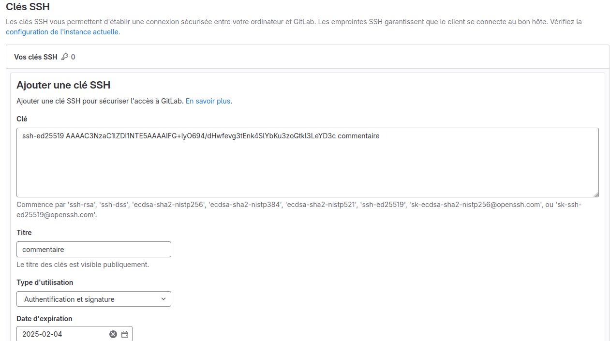

# TP2
**diiference entre fetch et pull, robas et merge**
## Creation de branche

```cmd
test@202-13:~/Bureau/karma_analysis$ git switch -c doc/contrib_Lucas
Basculement sur la nouvelle branche 'doc/contrib_Lucas'
git push -u origin doc/contrib_Lucas
```


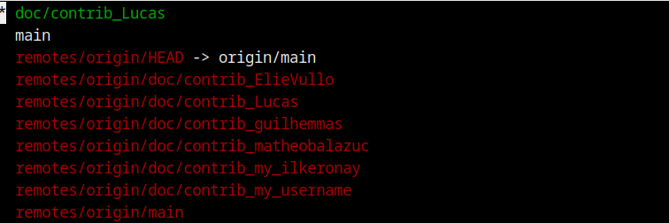

## Etape 2:
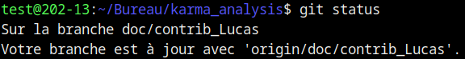


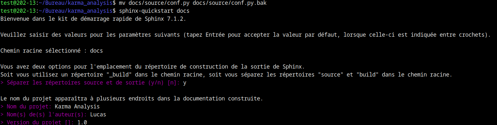

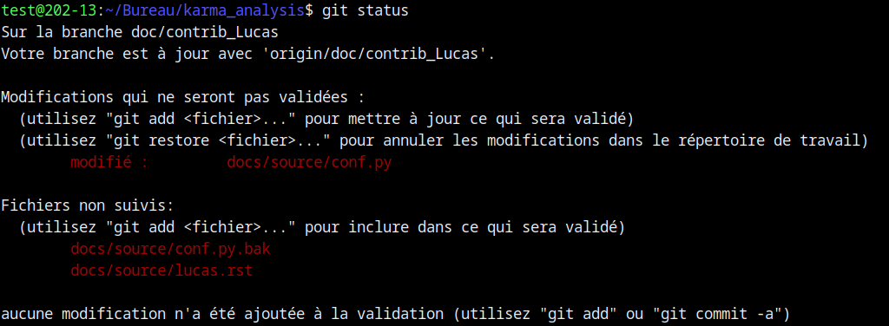

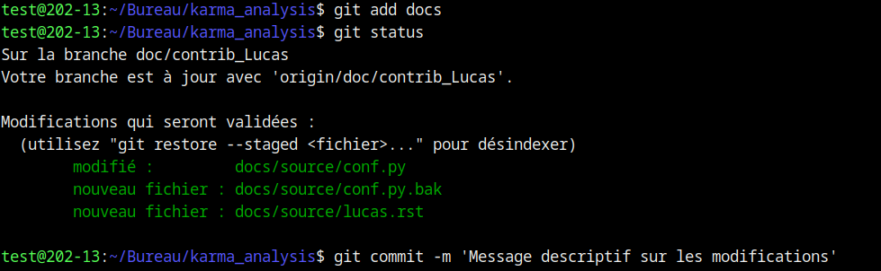

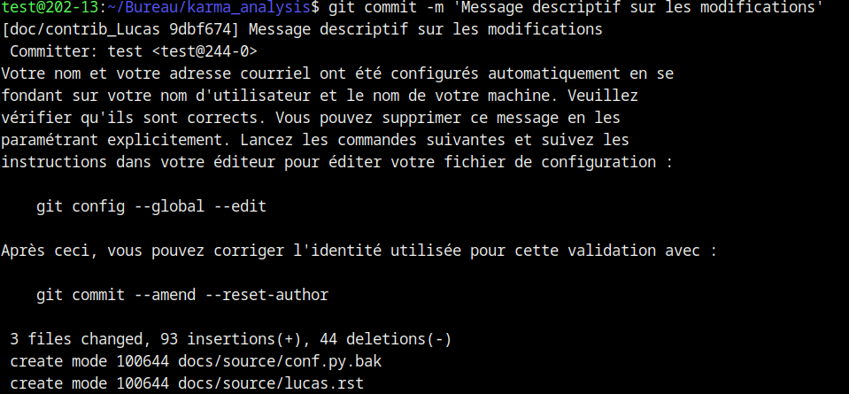

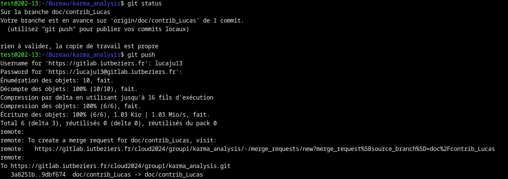

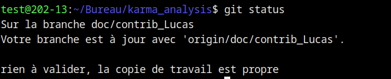

## Etape 3:
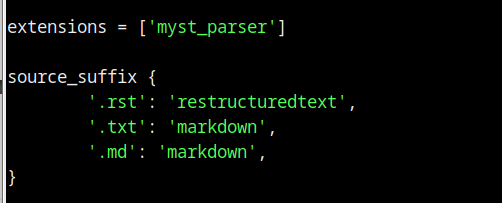

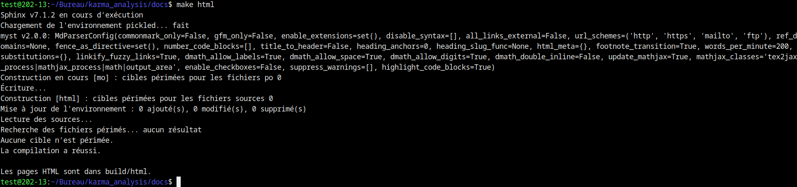

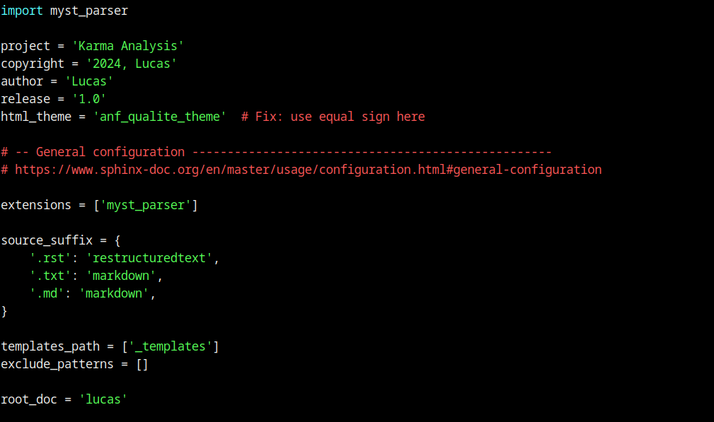

## Etape 4:

## Etape 5:
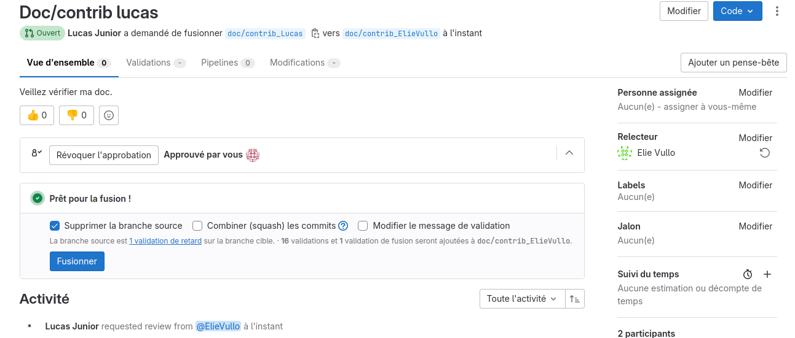

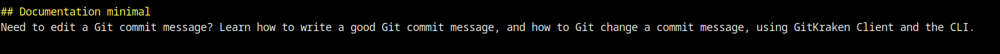

## Etape 6: Utilisation de docstrings
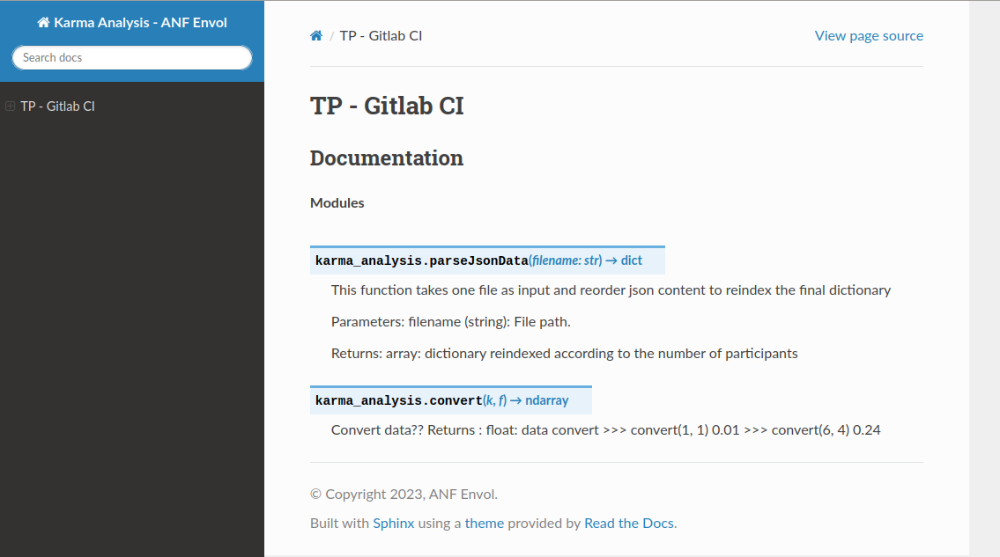

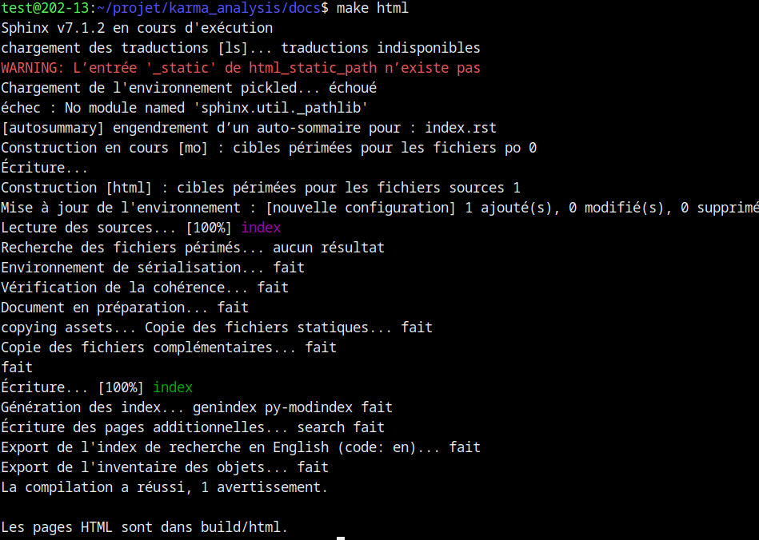

## Etape 7: Generation automatique de la documentation
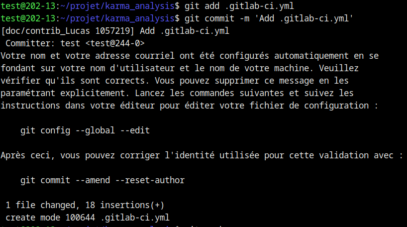

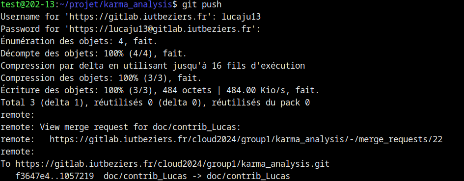

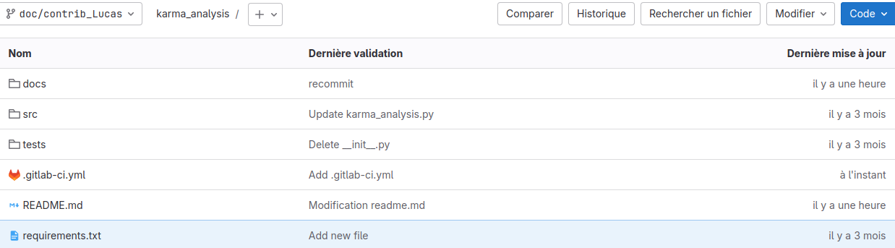

