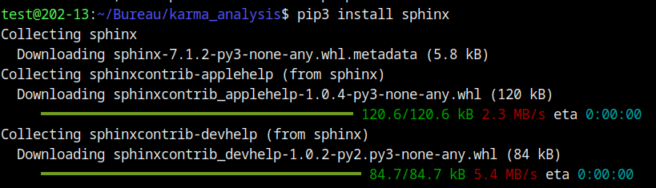
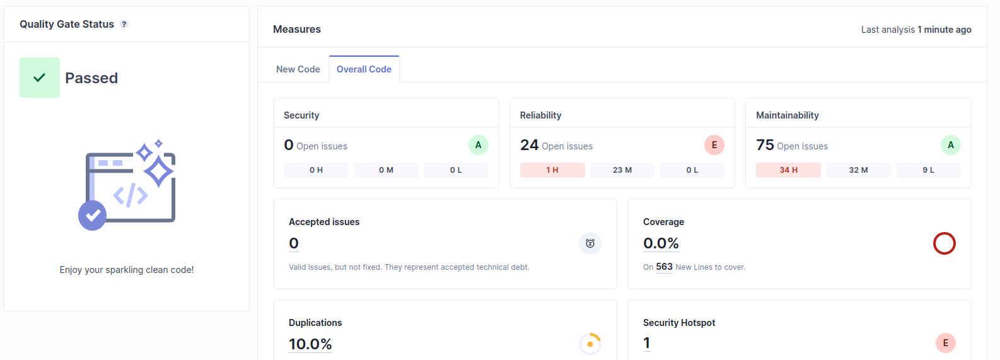
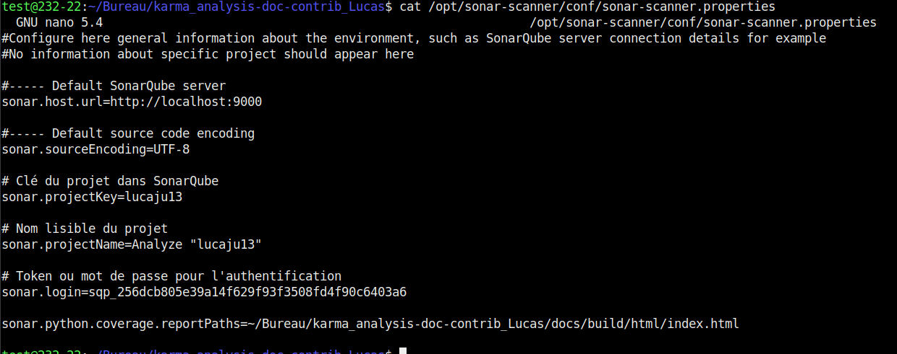
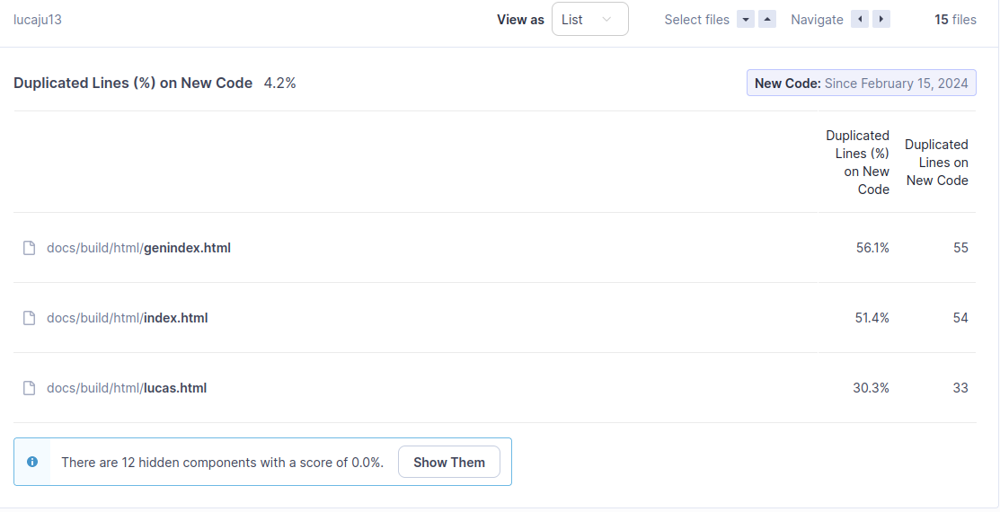

# TP1

### Etape 0:

```cmd
ssh-keygen -t ed25519 -C "commentaire" -f cle
Generating public/private ed25519 key pair.
Enter passphrase (empty for no passphrase): 
Enter same passphrase again: 
Your identification has been saved in cle
Your public key has been saved in cle.pub
The key fingerprint is:
SHA256:s4tvvOGqIza6l9IwLu8t9ODcd+zafEojnDCjX+xN1qA commentaire
```
### Fichier config :

```cmd
test@202-13:~/.ssh$ cat config 
Host registry.iutbeziers.fr
	User git
	PasswordAuthentication no
	IdentityFile ~/.ssh/cle
	ForwardX11 no
	ForwardAgent no	
```


# TP2
**diiference entre fetch et pull, robas et merge**
## Creation de branche

```cmd
test@202-13:~/Bureau/karma_analysis$ git switch -c doc/contrib_Lucas
Basculement sur la nouvelle branche 'doc/contrib_Lucas'
git push -u origin doc/contrib_Lucas
```


## Etape 2:





## Etape 3:


## Etape 4:

## Etape 5:


## Etape 6: Utilisation de docstrings


## Etape 7: Generation automatique de la documentation


```yaml
#image: python:3
stages:
  - deploy

deploy:
  stage: deploy
  script:
    - whoami
    - pwd
    - pip install numpy matplotlib scipy lxml sphinx sphinx-rtd-theme myst-parser --break-system-packages
    - cd docs
    - sphinx-build -b html source ./build/html
    - cp -R /home/gitlab-runner/builds/GwQay9zmB/0/cloud2024/group1/karma_analysis /tmp/monbuild/

  artifacts:
    paths:
      - docs
  only:
    - develop1
```

# TP3 - Evaluer et amelliorer 
## Etape 0:

## Etape 1:


## Etape 2: Typage en Python
```cmd
mypy --ignore-missing-imports src/karma_analysis.py
```


```cmd
 mypy --html-report type-coverage karma_analysis.py --ignore-missing-imports
```


```cmd
coverage run ../src/karma_analysis.py data1
coverage report -m
```


## Etape 3: Analyse de Qualité du code avec pylint et SonarQube
```cmd
pylint src/karma_analysis.py
```


```cmd
sonar-scanner   -Dsonar.projectKey=lucaju13   -Dsonar.sources=.   -Dsonar.host.url=http://localhost:9000   -Dsonar.token=sqp_256dcb805e39a14f629f93f3508fd4f90c6403a6
```



**Utilisation avancée du sonarcube:**

Remplacement des elements de ligne de comande en utilisant le fichier: sonar-project.properties


Utilisation de ```sonar.python.coverage.reportPaths``` :






## Etape 4:


