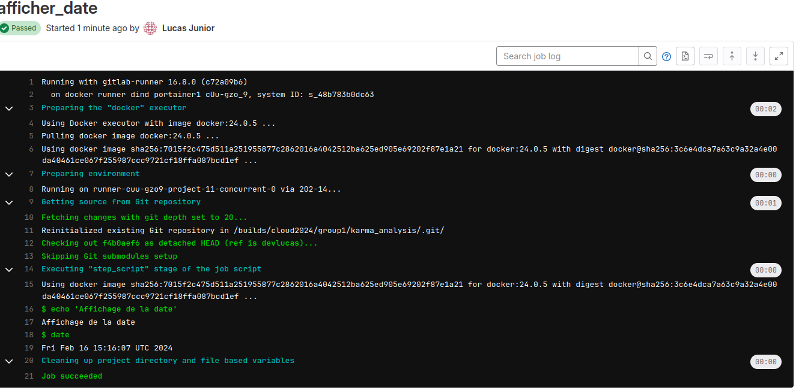

# TP1

### Etape 0:

```cmd
ssh-keygen -t ed25519 -C "commentaire" -f cle
Generating public/private ed25519 key pair.
Enter passphrase (empty for no passphrase): 
Enter same passphrase again: 
Your identification has been saved in cle
Your public key has been saved in cle.pub
The key fingerprint is:
SHA256:s4tvvOGqIza6l9IwLu8t9ODcd+zafEojnDCjX+xN1qA commentaire
```
### Fichier config :

```cmd
test@202-13:~/.ssh$ cat config 
Host registry.iutbeziers.fr
	User git
	PasswordAuthentication no
	IdentityFile ~/.ssh/cle
	ForwardX11 no
	ForwardAgent no	
```


## Problemes identifiés

- Documentation lacunaire;
- Manque de commentaires;
- Noms de variables non explicites;
- Utilisation d'un chemin de donnés en dur au lieu de l'argument en ligne de commande;
- Bug dans la fonction de calcul de la probabilité;
- Pas ou peu de tests, typage;
- Pas de règles de codage (mix camelCase et snake_case, espaces avant et après les opérateurs, etc)
- Pluseieurs imports sur la meme ligne et import de modules inutilisés;
- Pas de structuration sous forme de package Python pyptoject, toml/setup.py;
- Pas de listes des dependances (requirements.txt/pyproject.toml)


# TP2
**Diference entre fetch et pull, rebase et merge**

Fetch et pull sont des opérations pour récupérer des modifications depuis un référentiel distant, mais fetch laisse la fusion à l'utilisateur, tandis que pull fusionne automatiquement. Rebase et merge sont des opérations de fusion, mais rebase réécrit l'historique, tandis que merge crée un commit de fusion. Le choix entre ces opérations dépend des préférences de workflow et des besoins spécifiques du projet.

## Creation de branche

```cmd
test@202-13:~/Bureau/karma_analysis$ git switch -c doc/contrib_Lucas
Basculement sur la nouvelle branche 'doc/contrib_Lucas'
git push -u origin doc/contrib_Lucas
```


## Etape 2:


## Etape 3:


## Etape 4:

## Etape 5:


J'ai assingé mon camarade de classe Ellie Vullo comme "reviwer"

## Etape 6: Utilisation de docstrings


## Etape 7: Generation automatique de la documentation


```yaml
#image: python:3
stages:
  - deploy

deploy:
  stage: deploy
  script:
    - whoami
    - pwd
    - pip install numpy matplotlib scipy lxml sphinx sphinx-rtd-theme myst-parser --break-system-packages
    - cd docs
    - sphinx-build -b html source ./build/html
    - cp -R /home/gitlab-runner/builds/GwQay9zmB/0/cloud2024/group1/karma_analysis /tmp/monbuild/

  artifacts:
    paths:
      - docs
  only:
    - develop1
```


# TP3 - Evaluer et amelliorer 

## Etape 1:


## Etape 2: Typage en Python

```cmd
mypy --ignore-missing-imports src/karma_analysis.py
```


```cmd
 mypy --html-report type-coverage karma_analysis.py --ignore-missing-imports
```


```cmd
coverage run ../src/karma_analysis.py data1
coverage report -m
```


## Etape 3: Analyse de Qualité du code avec pylint et SonarQube

```cmd
pylint src/karma_analysis.py
```


Le résultat de pylint indique qu'il y a quelques problèmes de style et de convention le code.

J'ai ajouté des docstrings, changé quelques noms de variables pour les rendre plus explicites, et j'ai corrigé quelques espaces en fin de ligne pour respecter les conventions PEP 8.
```cmd
(env) test@232-22:~/karma_analysis$ pylint src/karma_analysis.py
************* Module karma_analysis
src/karma_analysis.py:161:0: C0301: Line too long (106/100) (line-too-long)
src/karma_analysis.py:165:0: C0301: Line too long (106/100) (line-too-long)
src/karma_analysis.py:1:0: C0114: Missing module docstring (missing-module-docstring)
src/karma_analysis.py:20:13: W1514: Using open without explicitly specifying an encoding (unspecified-encoding)
src/karma_analysis.py:27:8: W1203: Use lazy % formatting in logging functions (logging-fstring-interpolation)
src/karma_analysis.py:26:4: W0612: Unused variable 'e' (unused-variable)
src/karma_analysis.py:95:4: W0632: Possible unbalanced tuple unpacking with sequence defined at line 1028 of scipy.optimize._minpack_py: left side has 2 labels, right side has 5 values (unbalanced-tuple-unpacking)
src/karma_analysis.py:151:4: W1203: Use lazy % formatting in logging functions (logging-fstring-interpolation)
src/karma_analysis.py:152:4: W1203: Use lazy % formatting in logging functions (logging-fstring-interpolation)
src/karma_analysis.py:153:4: W1203: Use lazy % formatting in logging functions (logging-fstring-interpolation)
src/karma_analysis.py:154:4: W1203: Use lazy % formatting in logging functions (logging-fstring-interpolation)
src/karma_analysis.py:186:8: W1203: Use lazy % formatting in logging functions (logging-fstring-interpolation)

------------------------------------------------------------------
Your code has been rated at 8.38/10 (previous run: 7.43/10, +0.95)
```
```python3
import argparse
import json
import logging
import sys
import numpy as np
import matplotlib.pyplot as plt
from scipy.optimize import curve_fit as cf

def parse_json_data(filename: str) -> dict:
    """
    This function takes one file as input and reorders json content to reindex the final dictionary.

    Parameters:
    filename (str): File path.

    Returns:
    dict: Dictionary reindexed according to the number of participants.
    """
    try:
        with open(filename, "r") as file:
            data = json.load(file)
            # Sort the data by raclette consumption
            data = sorted(data, key=lambda x: x["raclette_consumption"])
            # Reshape the data to have one array per key
            data = {key: np.array([entry[key] for entry in data]) for key in data[0].keys()}
    except json.JSONDecodeError as e:
        logging.error(f"Json file '{filename}' format is not correct.")
        data = {}
    return data

def convert(k, f) -> float:
    """
    Convert data.

    Returns:
    float: Converted data.
    
    >>> convert(1, 1)
    0.01
    >>> convert(6, 4)
    0.24
    """
    prob = k * f / 100.0
    return prob

def linear(x, a, b) -> float:
    """
    Compute linear value from y = ax + b.

    Returns:
    float: y.

    >>> linear(4.8, 10, 5)
    53.0
    >>> linear(48, 1, 5)
    53
    """
    return a * x + b

def quadratic(x, a, b, c) -> float:
    """
    Compute quadratic value from y = ax^2 + bx + c.

    Returns:
    float: y.

    >>> quadratic(3, 5, -4, 0)
    33
    >>> quadratic(1, 5, -4, 0)
    1
    """
    return a * x**2 + b * x + c

def sinusoidal(x, a, b, c, d) -> float:
    """
    Compute sinusoidal value from y = a*sin(bx+c)+d.

    Returns:
    float: y.

    >>> sinusoidal(3, 5, -4, 0, 10)
    12.682864590002175
    >>> sinusoidal(1, 5, -4, 0, 10)
    13.784...
    """
    return a * np.sin(b * x + c) + d

def fit(data, func, p0=None) -> np.ndarray:
    """
    Fit data using the given function.

    Returns:
    np.ndarray: Fitted parameters.
    """
    params, _ = cf(func, data["raclette_consumption"], data["prob"], p0=p0)
    return params

def plot(data, params, func, name) -> None:
    """
    Plot the data and the fitted model.

    Returns:
    None
    """
    x = data["raclette_consumption"]
    x2 = np.linspace(x[0], x[-1], 100)

    model = func(x2, *params)

    plt.plot(x2, model, label=name, color="C1")
    plt.scatter(x, data["prob"], label="Data", color="C0")

    plt.xlabel("RC")
    plt.ylabel("RP")
    plt.title("Model")
    plt.legend()
    plt.show()

def compare_models(data) -> tuple:
    """
    Compare different models and return the best one.

    Returns:
    tuple: Best model information.
    """
    data["prob"] = convert(data["karma"], data["slug_factor"])

    param1 = fit(data, linear)
    param2 = fit(data, quadratic)
    param3 = fit(data, sinusoidal, p0=[10, 0.2, 0, 100])

    x = data["raclette_consumption"]
    prob = data["prob"]

    pred1 = linear(x, *param1)
    pred2 = quadratic(x, *param2)
    pred3 = sinusoidal(x, *param3)

    mse1 = np.mean((prob - pred1) ** 2)
    mse2 = np.mean((prob - pred2) ** 2)
    mse3 = np.mean((prob - pred3) ** 2)

    best_model = min(
        [
            (mse1, "Linear", param1, linear),
            (mse2, "Quadratic", param2, quadratic),
            (mse3, "Sinusoidal", param3, sinusoidal),
        ]
    )

    logging.info(f"Linear MSE: {mse1}")
    logging.info(f"Quadratic MSE: {mse2}")
    logging.info(f"Sinusoidal MSE: {mse3}")
    logging.info(f"Best model: {best_model[1]} with MSE {best_model[0]}")
    logging.info(best_model)

    return best_model

def main(argv=sys.argv[1:]) -> None:
    """
    Main function for analyzing the impact of raclette consumption on karma and reincarnation probability.
    """
    # Parse command line arguments
    parser = argparse.ArgumentParser(
        description="Analyzing the impact of raclette consumption on karma and reincarnation probability."
    )
    parser.add_argument("data_file", type=str, help="Path to the JSON data file")

    args = parser.parse_args(argv)
    file = vars(args)

    try:
        # Path to the json data (simulation results)
        file_path = "../data/" + file["data_file"] + ".json"

        # Parse the json data into a reindexed dictionary
        data = parse_json_data(file_path)

        # Compare the models
        model = compare_models(data)

        # Plot the results
        plot(data, model[2], model[3], model[1])

    except FileNotFoundError:
        logging.error(
            f"File named '{file['data_file']}.json' does not exist in the data directory."
        )

if __name__ == "__main__":
    main()

```
## SonarQube installation et Utilisation:

**Installation de sonarCLI sur linux**:

```cmd
wget https://binaries.sonarsource.com/Distribution/sonar-scanner-cli/sonar-scanner-cli-5.0.1.3006-linux.zip
sudo unzip sonar-scanner-cli-5.0.1.3006-linux.zip -d /opt
export PATH=$PATH:/opt/sonar-scanner-cli-5.0.1.3006-linux/bin
source ~/.bashrc
sonar-scanner -v
```

**Installation Sonar sous docker:**

commande:

```cmd
docker run -d --name sonarqube -p 9000:9000 -p 9092:9092 sonarqube
```


```cmd
sonar-scanner \
  -Dsonar.projectKey=test \
  -Dsonar.sources=. \
  -Dsonar.host.url=http://localhost:9000 \
  -Dsonar.token=sqp_340945536f28534df2ee426dc44cc0b79a8e4ef2
```


On voit bien que coverage "Failed".

*Petit changement de projet car j'ai changé de PC*

**Utilisation avancée du sonarcube:**

Remplacement des elements de ligne de comande en utilisant le fichier: sonar-project.properties

Utilisation de ```sonar.python.coverage.reportPaths``` :

Geneation du fichier xml:

```cmd
(env) test@203-0:~/karma_analysis/data$ coverage xml
Wrote XML report to coverage.xml
(env) test@203-0:~/karma_analysis/data$ ls
coverage.xml  data1.json  data2.json
```

Dans le fichier de configuration sonar que se trouve: ```/opt/sonar-scanner-5.0.1.3006-linux/conf/sonar-scanner.properties ``` :

```cmd
# Configure here general information about the environment, such as SonarQube server details
# No information about the specific project should appear here

# Default SonarQube server
sonar.host.url=http://localhost:9000

sonar.login=admin
sonar.password=root


# Default source code encoding
sonar.sourceEncoding=UTF-8

# Project specific configuration
sonar.projectKey=test
sonar.sources=.
sonar.token=sqp_340945536f28534df2ee426dc44cc0b79a8e

#Utilisation de la fonction coverage
sonar.python.coverage.reportPaths=./data/coverage.xml
```
**Coverage sur SonarQube:**


**Tests en Quality A:**


## Etape 4: Respect de normes de codage

**Installation pre-comit**
```cmd
pip install pre-commit
```
Mon fichier de config pre-commit, j'ai utilisé python3.9.2 car c'est la version que j'ai installé sur ma achine:

```yaml
(env) test@203-0:~/karma_analysis$ cat .pre-commit-config.yaml 
repos:
  - repo: https://github.com/psf/black-pre-commit-mirror
    rev: 23.9.1
    hooks:
      - id: black
        language_version: python3.9.2
```

**Execution de la commande**:
```cmd
(env) test@203-0:~/karma_analysis$ pre-commit install
pre-commit installed at .git/hooks/pre-commit
```


# TP4: Integration et Deployment Continuos (CI/CD)

## Etape 0 :

Installation du runner docker :
```cmd
docker run -d --name gitlab-runner --restart always \
  -v /srv/gitlab-runner/config:/etc/gitlab-runner \
  -v /var/run/docker.sock:/var/run/docker.sock \
  gitlab/gitlab-runner:latest

Unable to find image 'gitlab/gitlab-runner:latest' locally
latest: Pulling from gitlab/gitlab-runner
8ee087424735: Pull complete 
b5b212477f4d: Pull complete 
26ea82d464e3: Pull complete 
Digest: sha256:572cb10712c7c9c6f8be8b6d7ca26d2422b2b5b3afa7ed08b843a9473d002159
Status: Downloaded newer image for gitlab/gitlab-runner:latest
9190db8b2c89d081bf05636bc51d34385f8b622314f65bcac6b5c4e140f81672
```

conf du mon runner:

```cmd
gitlab-runner register  --url https://gitlab.iutbeziers.fr  --token glrt-M5fNm4xuzsuZyxYuLTbf
```
## Etape 1 :
- Job test:

```yml
#image: python:3
stages:
  - test

job_test:
  stage: test
  script:
    - echo 'Hello World, its Lucas'
```
**Resultat:**


**Solution 2:**
En choisisant le conteneur en fonction d'un mot-clé spécifié: Ubuntu

```yml
stages:
  - test

variables:
  CONTAINER_IMAGE: "ubuntu"

job_test:
  stage: test
  script:
    - if [ "$CONTAINER_IMAGE" == "ubuntu" ]; then
        echo 'Using Ubuntu container';
      elif [ "$CONTAINER_IMAGE" == "python" ]; then
        echo 'Using Python container';
      else
        echo 'Using default Ubuntu container';
      fi
    - echo 'Hello World, its Lucas'
```


**Solution 3: 3 stages differents**

```yml
stages:
  - afficher_date
  - afficher_contenu_repertoire
  - informations_systeme

variables:
  CONTAINER_IMAGE: "ubuntu:20.04"

afficher_date:
  stage: afficher_date
  script:
    - echo 'Affichage de la date'
    - date

afficher_contenu_repertoire:
  stage: afficher_contenu_repertoire
  script:
    - echo 'Affichage du contenu du répertoire courant'
    - ls -al

informations_systeme:
  stage: informations_systeme
  script:
    - echo "Informations système sur l'environnement d'exécution"
    - uname -a
    - |
      if command -v lsb_release &> /dev/null; then
        echo "lsb_release is installed."
      else
        if command -v apk &> /dev/null; then
          apk update && apk add lsb-release
        elif command -v apt-get &> /dev/null; then
          apt-get update && apt-get install -y lsb-release
        elif command -v yum &> /dev/null; then
          yum install -y redhat-lsb-core
        else
          echo "Unsupported package manager. Please install lsb-release manually."
        fi
      fi
    - lsb_release -a || true
```





**PS: Ce script vérifie d'abord si lsb_release est installé en utilisant command -v et tente ensuite de l'installer avec différents gestionnaires de paquets (apk, apt-get, yum). Si aucun d'entre eux n'est trouvé, il affiche un message indiquant que le gestionnaire de paquets n'est pas pris en charge, et vous devrez peut-être installer lsb-release manuellement ou ajuster le script en fonction des outils disponibles dans votre image Docker.**

Lorsque je ajoute une ligne dont la commande n'est pas correcte, le pipeline s'arrete a stage 2, il n'execute pas le stage 3:

*voici la ligne ajouté comme erreur dans le stage 2:*

```yml
 - commande_inexistante  # Cette ligne introduit une erreur délibérée
```

**Resultat lors d'éxecution:**


**Modifs sur le yml**:

```yml
stages:
  - afficher_date
  - afficher_contenu_repertoire
  - informations_systeme

variables:
  CONTAINER_IMAGE: "ubuntu:20.04"

afficher_date:
  stage: afficher_date
  script:
    - echo 'Affichage de la date'
    - date

afficher_contenu_repertoire:
  stage: afficher_contenu_repertoire
  script:
    - echo 'Affichage du contenu du répertoire courant'
    - commande_inexistante  # Cette ligne introduit une erreur délibérée
    - ls -al
  allow_failure: true  # Ajout de l'option pour permettre l'échec sans arrêter le pipeline

informations_systeme:
  stage: informations_systeme
  script:
    - echo "Informations système sur l'environnement d'exécution"
    - uname -a
    - |
      if command -v lsb_release &> /dev/null; then
        echo "lsb_release est installé."
      else
        if command -v apk &> /dev/null; then
          apk update && apk add lsb-release
        elif command -v apt-get &> /dev/null; then
          apt-get update && apt-get install -y lsb-release
        elif command -v yum &> /dev/null; then
          yum install -y redhat-lsb-core
        else
          echo "Gestionnaire de paquets non pris en charge. Veuillez installer lsb-release manuellement."
        fi
      fi
    - lsb_release -a || true
```
Avec la ligne **"allow_failure: true  # Ajout de l'option pour permettre l'échec sans arrêter le pipeline""** permet d'executer le stage 3, meme si le stage 2 ne passe pas.

**Resultat:**


### Rules
En utilisant les rules, j'ai pu obtenir ça comme script: 
```yml
stages:
  - afficher_date
  - afficher_contenu_repertoire
  - informations_systeme

variables:
  CONTAINER_IMAGE: "ubuntu:20.04"

afficher_date:
  stage: afficher_date
  script:
    - echo 'Affichage de la date'
    - date

afficher_contenu_repertoire:
  stage: afficher_contenu_repertoire
  script:
    - echo 'Affichage du contenu du répertoire courant'
    - ls -al
  rules:
    - exists:
      - "devlucas/**/*"

informations_systeme:
  stage: informations_systeme
  script:
    - echo "Informations système sur l'environnement d'exécution"
    - uname -a
    - |
      if command -v lsb_release &> /dev/null; then
        echo "lsb_release est installé."
      else
        if command -v apk &> /dev/null; then
          apk update && apk add lsb-release
        elif command -v apt-get &> /dev/null; then
          apt-get update && apt-get install -y lsb-release
        elif command -v yum &> /dev/null; then
          yum install -y redhat-lsb-core
        else
          echo "Gestionnaire de paquets non pris en charge. Veuillez installer lsb-release manuellement."
        fi
      fi
    - lsb_release -a || true
  rules:
    - exists:
    - changes:
        - "*"
    - exists:
        - $CI_COMMIT_TAG
```
**J'ai crée ma propre branche devlucas, au lieu develop**

**Résultat:**


## Etape 2 : Automatisation de tests et generation de la documentation


