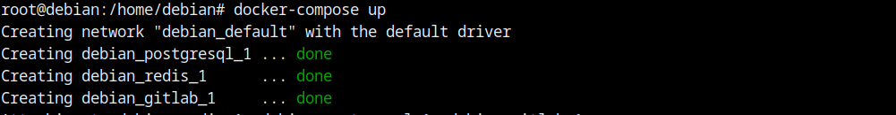
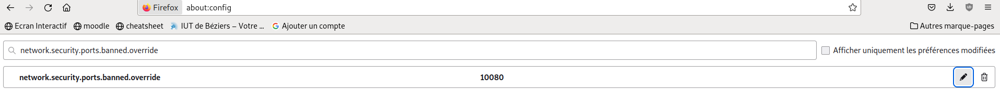
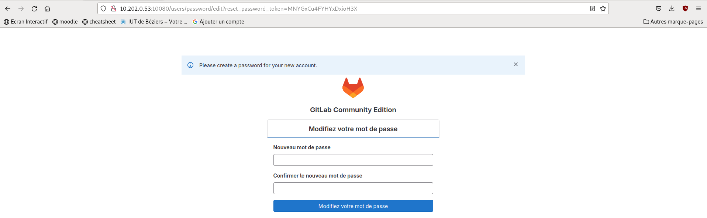
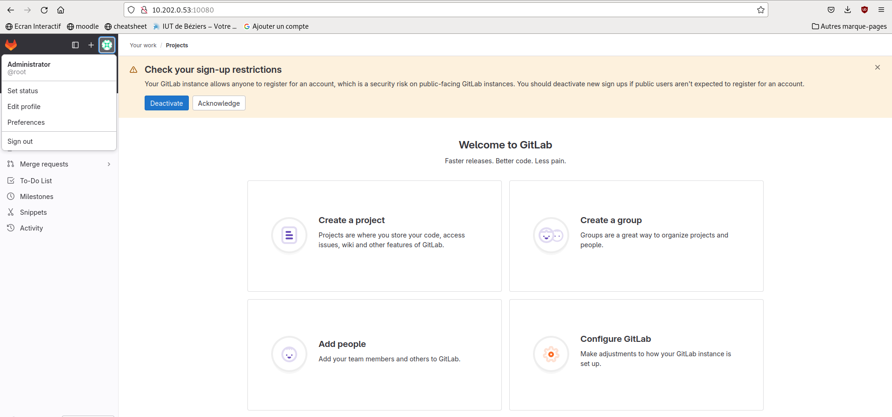
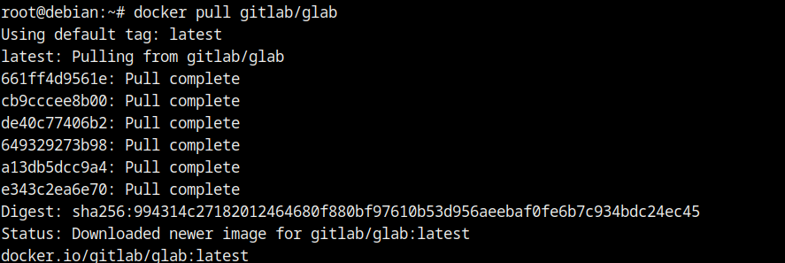
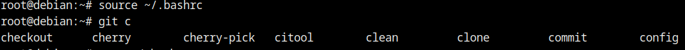

# Gitlab dans tous ces états
## Comment contribuer à un projet ?
### Termes liés à Git:

**1. Feature "branching":**

**2. Pull request ou merge request:**

**3. Cherry picking:**

**4. merge et rebase:**

## I - Installation de Gitlab soit sous forme d’un container Docker, soit sur une machine virtuelle.
### Installation
[Source](https://github.com/sameersbn/docker-gitlab)
```cmd
docker pull sameersbn/gitlab:16.8.1
```

```cmd
root@debian:/home/debian# docker pull sameersbn/gitlab:16.8.1
16.8.1: Pulling from sameersbn/gitlab
521f275cc58b: Pull complete 
4540f875af57: Pull complete 
785e0c38a959: Pull complete 
ee1c9058318e: Pull complete 
357ad71158a4: Pull complete 
a7287c58934f: Pull complete 
7d3e58b4de17: Pull complete 
c1dae7ce0e53: Pull complete 
Digest: sha256:37eae09ed72578f6e57e8f949c2c7a6fd8b5422a4902b330d44df7879c3f619d
Status: Downloaded newer image for sameersbn/gitlab:16.8.1
docker.io/sameersbn/gitlab:16.8.1
```
**Etape 2:**
Docker compose, pour l'initializer plus rapidement:

```cmd
wget https://raw.githubusercontent.com/sameersbn/docker-gitlab/master/docker-compose.yml
```
ensuite:

```cmd
docker-compose up
```


J'ai du faire unblock du port 10080 sur firefox pour pouvoir acceder au Gitlab server:
J'ai tabe sur la barre d'URL: about:config, ensuite j'ai cherché: "network.security.ports.banned.override" et j'ai ajouté le port 10080.



**Résultat:**


*Credentials:*

**User: root** 

**Pass: Lucaju@13** 



## II - Utilisation de glab
####  Installation et paramétrage de glab
**1 - Installez glab sur une machine.**

```cmd
docker pull gitlab/glab
```


**2. Activation la complétion automatique pour glab.**

Ajout de lignes suivantes dans mon fichier ~/.bashrc
```cmd
if [ -f /usr/share/bash-completion/completions/git ]; then
    . /usr/share/bash-completion/completions/git
elif [ -f /etc/bash_completion.d/git ]; then
    . /etc/bash_completion.d/git
fi
```
ensuite j'ai redemmaré:
```cmd
source ~/.bashrc
```

**test:**


**3. Création un token sur votre compte gitlab.**

