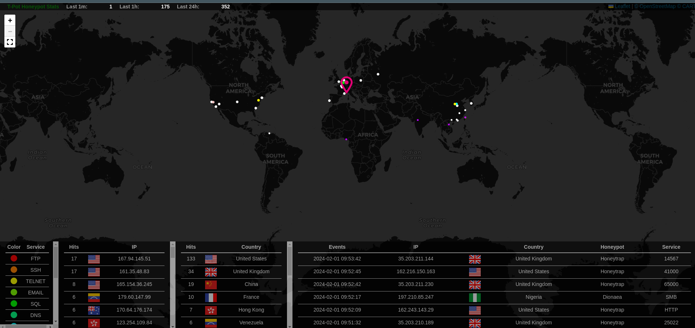

# Nextcloud & Tpot
## Installation
**Fichier docker-compose**:
```yaml
version: ’3’
services:
  proxy:
    image: jwilder/nginx-proxy:alpine
    labels:
      - "com.github.jrcs.letsencrypt_nginx_proxy_companion.nginx_proxy=true"
    container_name: nextcloud-proxy
    networks:
      - nextcloud_network
    ports:
      - 80:80
      - 443:443
    volumes:
      - ./proxy/conf.d:/etc/nginx/conf.d:rw
      - ./proxy/vhost.d:/etc/nginx/vhost.d:rw
      - ./proxy/html:/usr/share/nginx/html:rw
      - ./proxy/certs:/etc/nginx/certs:ro
      - /etc/localtime:/etc/localtime:ro
      - /var/run/docker.sock:/tmp/docker.sock:ro
    restart: unless-stopped
  letsencrypt:
    image: jrcs/letsencrypt-nginx-proxy-companion
    container_name: nextcloud-letsencrypt
    depends_on:
      - proxy
    networks:
      - nextcloud_network
    volumes:
      - ./proxy/certs:/etc/nginx/certs:rw
      - ./proxy/vhost.d:/etc/nginx/vhost.d:rw
      - ./proxy/html:/usr/share/nginx/html:rw
      - /etc/localtime:/etc/localtime:ro
      - /var/run/docker.sock:/var/run/docker.sock:ro
    restart: unless-stopped
  db:
    image: mariadb
    container_name: nextcloud-mariadb
    networks:
      - nextcloud_network
    volumes:
      - db:/var/lib/mysql
      - /etc/localtime:/etc/localtime:ro
    environment:
      - MYSQL_ROOT_PASSWORD
      - MYSQL_PASSWORD
      - MYSQL_DATABASE
      - MYSQL_USER
    restart: unless-stopped
  app:
    image: nextcloud:latest
    container_name: nextcloud-app
    networks:
      - nextcloud_network
    depends_on:
      - letsencrypt
      - proxy
      - db
    volumes:
      - nextcloud:/var/www/html
      - ./app/config:/var/www/html/config
      - ./app/custom_apps:/var/www/html/custom_apps
      - ./app/data:/var/www/html/data
      - ./app/themes:/var/www/html/themes
      - /etc/localtime:/etc/localtime:ro
    environment:
      - VIRTUAL_HOST
      - LETSENCRYPT_HOST
      - LETSENCRYPT_EMAIL
    restart: unless-stopped
volumes:
  nextcloud:
  db:
networks:
  nextcloud_network:
```
user: lucas
pass: lucaju@1306


**Config de T-pot**:
```cmd
git clone https://github.com/telekom-security/tpotce
cd tpotce/iso/installer/
./install.sh --type=user
```




**Config backup**:
```cmd
rclone config
```


**Etape 2:**
```bash
#!/bin/bash

# Paramètres de sauvegarde
BACKUP_DIR="/mnt/storage/backup"
NEXTCLOUD_DIR="http://10.202.0.115:8080"
RCLONE_REMOTE="remote"

# Commande de sauvegarde
tar -czvf $BACKUP_DIR/backup_$(date +"%Y%m%d").tar.gz /mnt/storage/backup

# Transfert vers NextCloud
rclone copy $BACKUP_DIR/backup_$(date +"%Y%m%d").tar.gz $RCLONE_REMOTE:$NEXTCLOUD_DIR
```


