# Le Stockage Objet MinIO
##  Implémentation d’un stockage objet:Minio
### Installation et Configuration de MinIO

#### Création d'un Utilisateur et d'un Groupe pour MinIO
```cmd
root@debian:~# groupadd -r minio-user
root@debian:~# useradd -r -g minio-user -s -d /home/minio-user /sbin/nologin minio-user
root@debian:~# useradd -r -g minio-user -d /home/minio-user -s /sbin/nologin minio-user
root@debian:~# mkdir /data
root@debian:~# chown minio-user:minio-user /data
root@debian:~# chmod 750 /data
```
#### Installation de MinIO via DEB
```cmd
root@debian:~# wget https://dl.min.io/server/minio/release/linux-amd64/minio.deb--2024-01-29 08:57:54--  https://dl.min.io/server/minio/release/linux-amd64/minio.deb
Résolution de dl.min.io (dl.min.io)… 178.128.69.202, 138.68.11.125
Connexion à dl.min.io (dl.min.io)|178.128.69.202|:443… connecté.
requête HTTP transmise, en attente de la réponse… 200 OK
Taille : 35683782 (34M) [application/vnd.debian.binary-package]
Sauvegarde en : « minio.deb »

minio.deb                    100%[===========================================>]  34,03M   816KB/s    ds 71s     

2024-01-29 08:59:05 (494 KB/s) — « minio.deb » sauvegardé [35683782/35683782]

root@debian:~#  dpkg -i minio.deb
Sélection du paquet minio précédemment désélectionné.
(Lecture de la base de données... 34127 fichiers et répertoires déjà installés.)
Préparation du dépaquetage de minio.deb ...
Dépaquetage de minio (20240129035632.0.0) ...
Paramétrage de minio (20240129035632.0.0) ...
```
#### Configuration des Variables d'Environnement
- Créez le fichier de configuration :
```cmd
nano /etc/default/minio

GNU nano 7.2                                                                          /etc/default/minio                                                                                    
MINIO_ACCESS_KEY=minio-user
MINIO_SECRET_KEY=myadmin123minio
MINIO_VOLUMES="/data"
```
- Ajout de permissions:
```cmd
mkdir /mnt/disk1 /mnt/disk2 /mnt/disk3 /mnt/disk4
chown minio-user:minio-user /mnt/disk1 /mnt/disk2 /mnt/disk3 /mnt/disk4

groupadd -r minio-user
useradd -M -r -g minio-user minio-user
chown minio-user:minio-user /mnt/disk1 /mnt/disk2 /mnt/disk3 /mnt/disk4

systemctl enable minio.service
sudo systemctl restart  minio.service
```
- Fonctionnement:
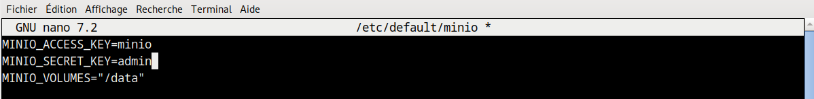

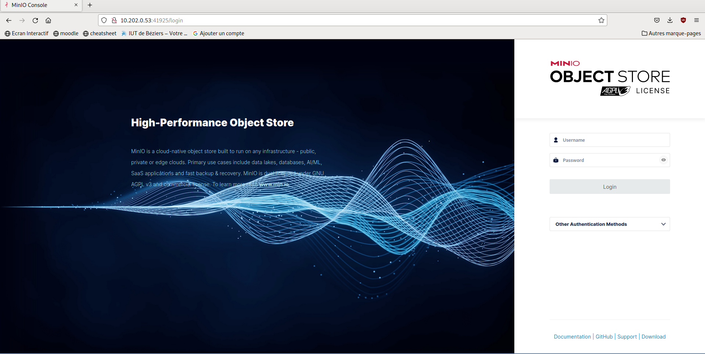

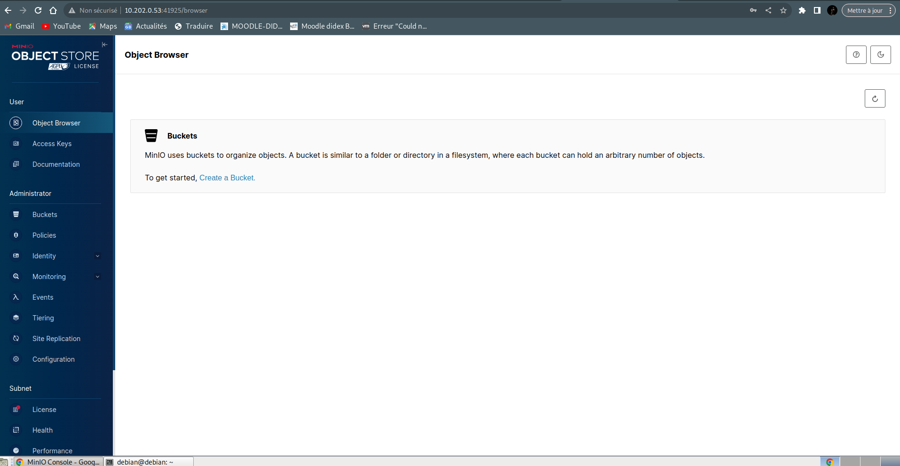
#### Génération des Certificats
J'ai rencontré des difficultés lors du login minio-user:
```cmd
root@debian:~# sudo su - minio-user
su: avertissement : impossible de changer le répertoire vers /home/minio-user: Aucun fichier ou dossier de ce type
```
J'ai du faire:
```cmd
root@debian:~# mkdir /home/minio-user
root@debian:~# chown minio-user:minio-user /home/minio-user
root@debian:~# sudo usermod -s /bin/bash minio-user
root@debian:~# su - minio-user
minio-user@debian:~$ 
```
```cmd
root@debian:~# su - minio-user
minio-user@debian:~$ mkcert -key-file key.pem -cert-file cert.pem minio.lucaslocal 
Created a new local CA 💥
Note: the local CA is not installed in the system trust store.
Run "mkcert -install" for certificates to be trusted automatically ⚠️

Created a new certificate valid for the following names 📜
 - "minio.lucaslocal"

The certificate is at "cert.pem" and the key at "key.pem" ✅

It will expire on 29 April 2026 🗓

minio-user@debian:~$ mkdir -p ~/.minio/certs/
minio-user@debian:~$ mv key.pem ~/.minio/certs/private.key
minio-user@debian:~$ mv cert.pem ~/.minio/certs/public.crt
```

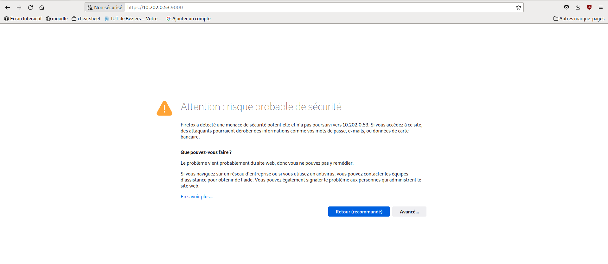
### Partie II - Utilisation de "minio"
- Creation de bucket "test" ajout d'image et versionalisation:
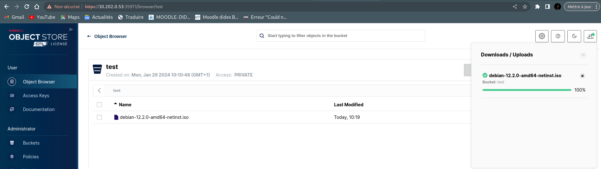
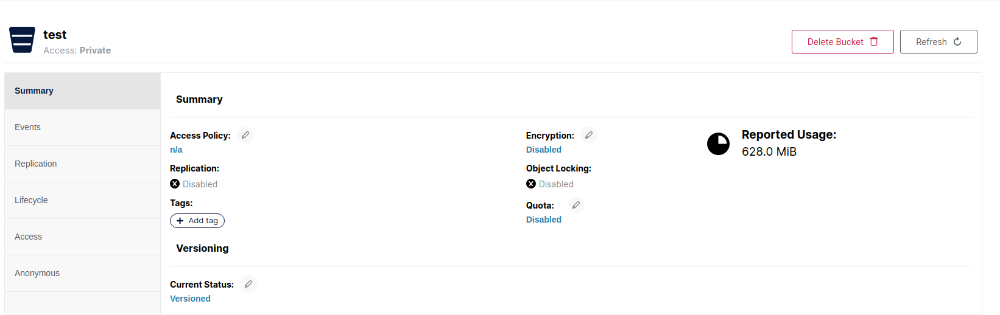

### Installation et utilisation du client minio "mc"
1 - Installation 'mc'
```cmd
root@debian:~# wget https://dl.minio.io/client/mc/release/linux-amd64/mc
--2024-01-29 10:58:31--  https://dl.minio.io/client/mc/release/linux-amd64/mc
Résolution de dl.minio.io (dl.minio.io)… 178.128.69.202, 138.68.11.125
Connexion à dl.minio.io (dl.minio.io)|178.128.69.202|:443… connecté.
requête HTTP transmise, en attente de la réponse… 200 OK
Taille : 26873856 (26M) [application/octet-stream]
Sauvegarde en : « mc »

mc                            100%[===============================================>]  25,63M  1,82MB/s    ds 37s     

2024-01-29 10:59:09 (706 KB/s) — « mc » sauvegardé [26873856/26873856]

root@debian:~# chmod +x mc
root@debian:~#  mv mc /usr/local/bin
```

- Creation d'un alias:
```cmd
root@debian:~# mc alias set lucaju https://debian:9000 minio-user myadmin123minio --insecure
```
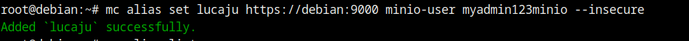
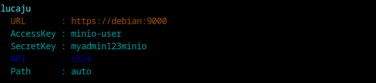

- Ping:
```cmd
root@debian:~# mc admin info lucaju --insecure
```
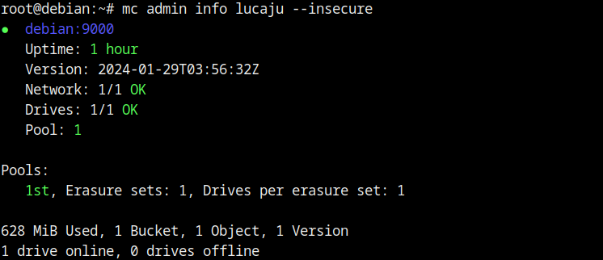

- Création d'un bucket "testbucket & list de tous les buckets sur mon serveur Minio.
```cmd
root@debian:~# mc ls lucaju --insecure
```
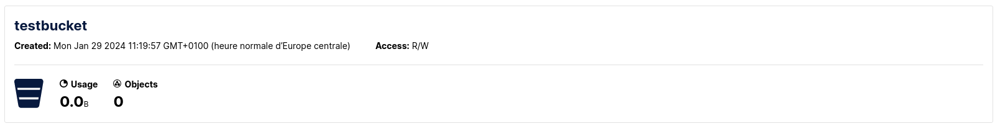
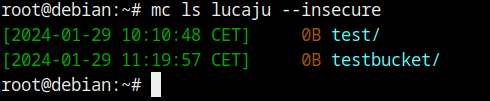

- Ajoute d'une directory et fichiers sur mon bucket.
```cmd
root@debian:~# mkdir test_rep
root@debian:~# cp minio.deb test_rep/
root@debian:~# mc cp -r test_rep lucaju/testbucket --insecure
/root/test_rep/minio.deb:          34.03 MiB / 34.03 MiB ━━━━━━━━━━━━━━━━━━━━━━━━━━━━━━━━━━━━━━━━━━━━━━━━━━━━━━━━━━━━━━━━━━━━━━━━━━━━━━━━━━━━━━━━━━━━━━━━━━━━━━━━━━━━━━━━━━━━━ 288.56 MiB/s 0sroot@debian:~# 
```
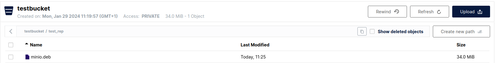

- Calcul de la taille occupée par les fichiers copiés
```cmd
root@debian:~# mc du lucaju/testbucket/test_rep --insecure
34MiB	1 object	testbucket/test_rep
```
- les fichiers de mon bucket commençant par une lettre donnée & copie de fichier de mon bucket dans /tmp..
```cmd
root@debian:~# mc find lucaju/testbucket/test_rep --insecure --name "m*"
```
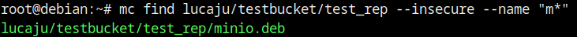

```cmd
root@debian:~# mc cp -r lucaju/testbucket/ /tmp --insecure
```
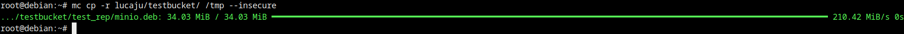

- Suppression de mon bucket
```cmd
root@debian:~# mc rb --insecure lucaju/testbucket --force
```
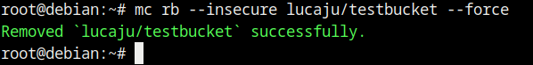
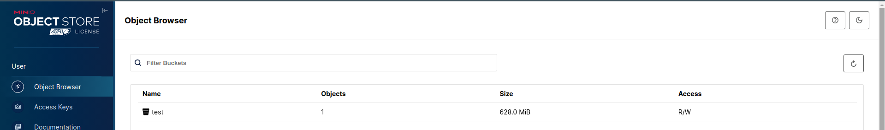

## Partie III - Python et minio
[Tuto link](https://www.stackhero.io/fr-fr/services/MinIO/documentations/Pour-commencer/Se-connecter-a-MinIO-depuis-Python)
### Se connecter à MinIO avec le SDK MinIO
- Installez le paquet MinIO :
```cmd
apt install pip
python3 -m venv /home/env
source /home/env/bin/activate
(env) root@debian:~# 
pip install minio
pip freeze > requirements.txt
```
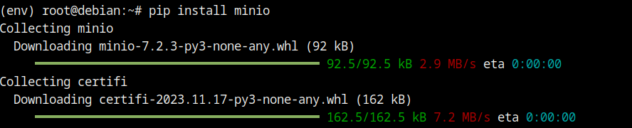
- Execution du script, vous pouvez trouver [ici](../scripts/file_uploader.py)
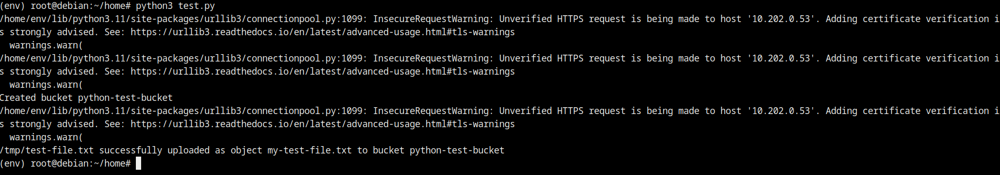
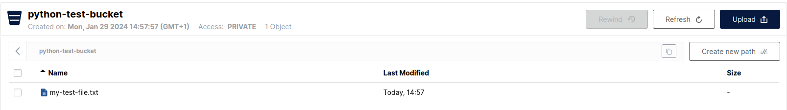

### Se connecter à MinIO avec le SDK AWS (boto)
- Installez le paquet AWS SDK (boto) :
```cmd
pip install boto3
pip freeze > requirements.txt
```
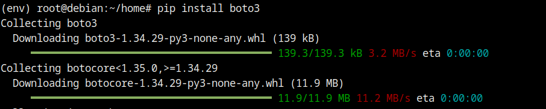

-  Execution du script, vous pouvez trouver [ici](../scripts/upload_boto3.py)
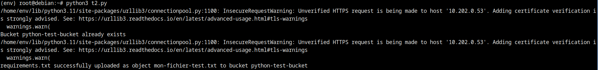

## Partie IV - Utilisation de Minio comme "backend de sauvegarde"
### Sauvegarde minio avec Kopia
**Procedures d'Installation Kopia**:
```cmd
curl -s https://kopia.io/signing-key | sudo gpg --dearmor -o /etc/apt/keyrings/kopia-keyring.gpg
echo "deb [signed-by=/etc/apt/keyrings/kopia-keyring.gpg] http://packages.kopia.io/apt/ stable main" | sudo tee /etc/apt/sources.list.d/kopia.list
sudo apt update
sudo apt install kopia
sudo apt install kopia-ui
```
**Lancement**:
```cmd
/usr/bin$ ./kopia-ui
```
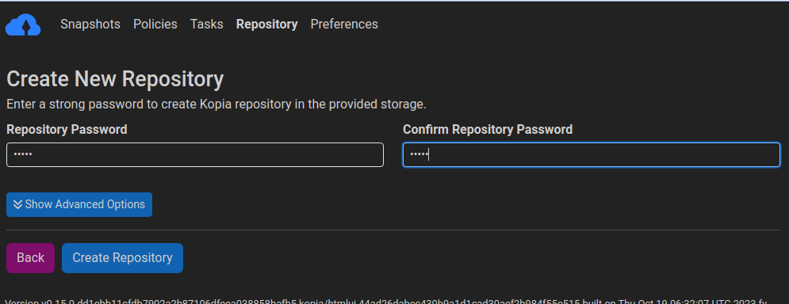
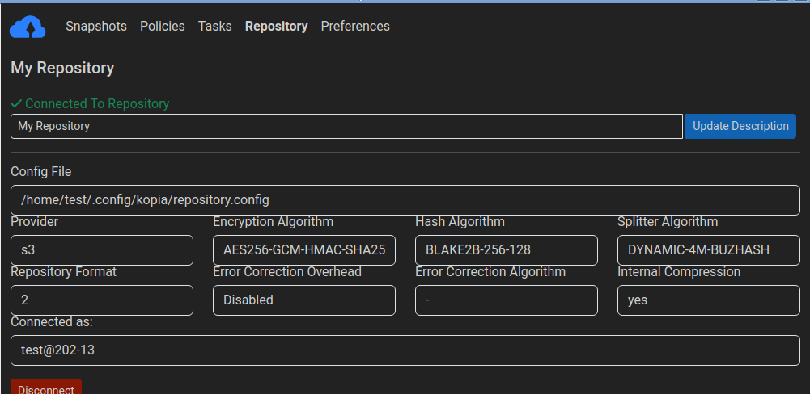
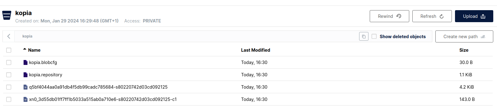

- Restore:
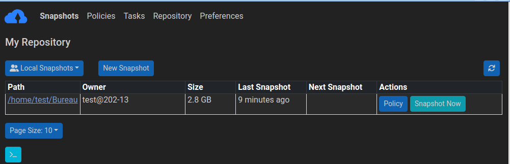
```cmd
test@202-13:~$ kopia restore k2fad822dae1a9fffe33b6905b51b4956  
```

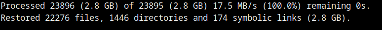


## Partie V: Sauvegarde d’un cluster kubernetes
### Installation de Kind
```cmd
# For AMD64 / x86_64
[ $(uname -m) = x86_64 ] && curl -Lo ./kind https://kind.sigs.k8s.io/dl/v0.20.0/kind-linux-amd64
chmod +x ./kind
sudo mv ./kind /usr/local/bin/kind
```
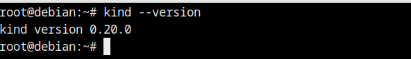
```cmd
kind create cluster
```
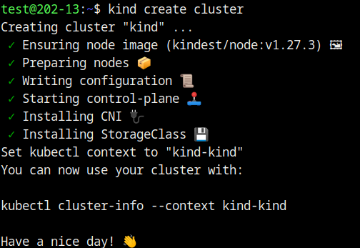
**Install Velero**:
```cmd
curl -LO https://github.com/vmware-tanzu/velero/releases/download/VERSION/velero-VERSION-linux-amd64.tar.gz
tar zxvf velero-VERSION-linuxamd64.tar.gz
sudo mv velero-VERSION-linux-amd64/velero /usr/local/bin/velero
```
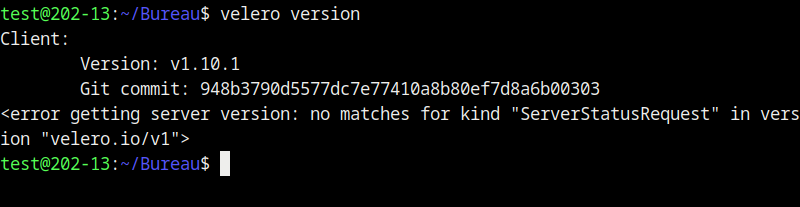

**Backup**:
```cmd
VELERO_FEATURES="insecure-tls" velero install --provider=aws \
  --plugins velero/velero-plugin-for-aws:v1.1.0 \
  --bucket python-test-bucket \
  --secret-file ./minio-credentials \
  --use-volume-snapshots=false \
  --backup-location-config region=minio,s3ForcePathStyle="true",s3Url=https://10.202.0.53:9000/

```
J'ai crée un fichier minio-credentials sur mon Bureau:
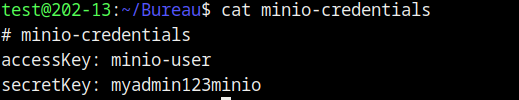
**Resultat**:
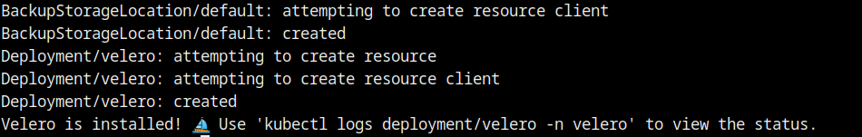

**Schedule avec velero**
```cmd
velero create schedule daily-backup --schedule="@daily"
velero get schedules
```
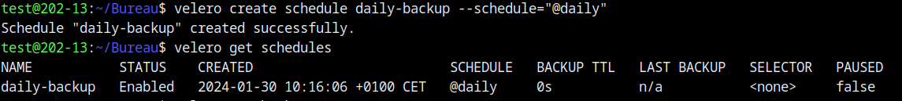

