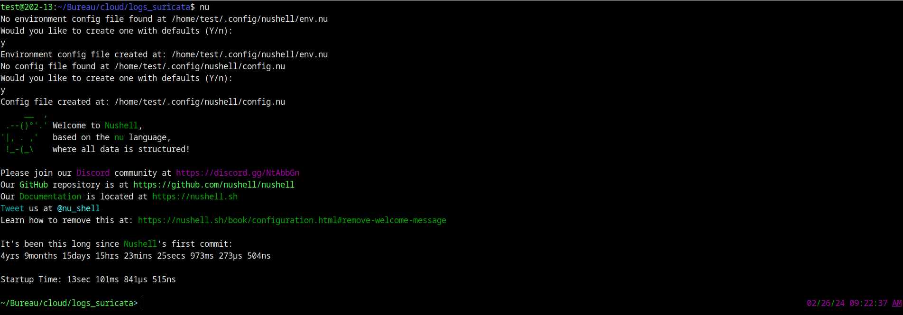
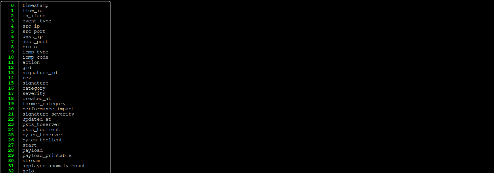

# Traitement de logs Suricata en utilisant nushell

## Etape 0: Pré-Requis

### Installation nushell sur linux

```cmd
sudo apt-get update
curl --proto '=https' --tlsv1.2 -sSf https://sh.rustup.rs | sh
source $HOME/.cargo/env
rustup update
export PATH="$HOME/.cargo/bin:$PATH"

```

Pour verifier l'installation du cargo: ```cargo version ```

```cmd
test@202-13:~$ cargo version 
cargo 1.65.0
```

Ensuite j'ai lancé la commande:

```cmd
cargo install nu --locked
```

```cmd
test@202-13:~/Bureau/cloud/logs_suricata$ nu --version
0.90.1
```

## Etape 1: Analyse de Logs

Aprés l'installation j'ai lancé nushell via la commande: ```nu```:




```cmd
curl -u NyKsYaWd7fYe4pC:iutbrtcloud2024 -H "X-Requested-With: XMLHttpRequest" -o suricata-telecharge.json.gz https://registry.iutbeziers.fr:4443/public.php/webdav/suricata/log/eve.json.1.gz
```

```nu
~/Bureau/SAE-Suricata/logs> cat eve.json.1 |jq -s '.'|from json|where event_type == "alert"|flatten|flatten|columns 
```


